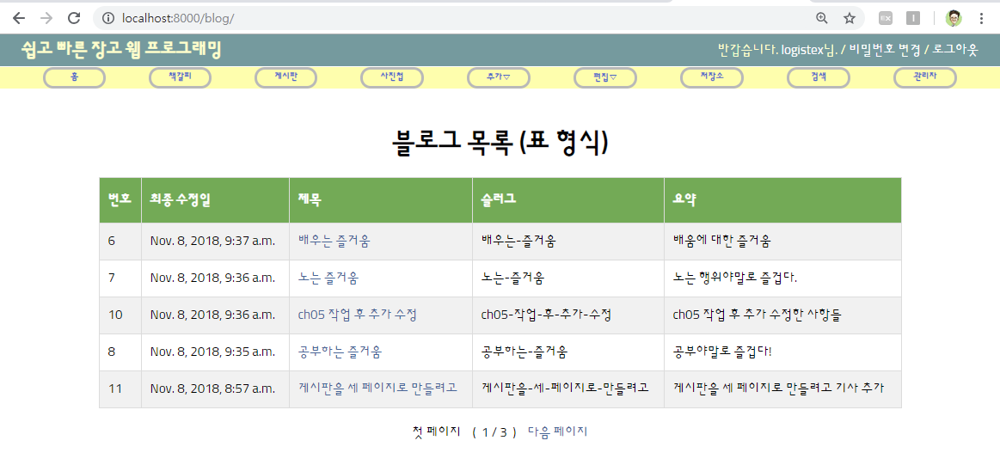
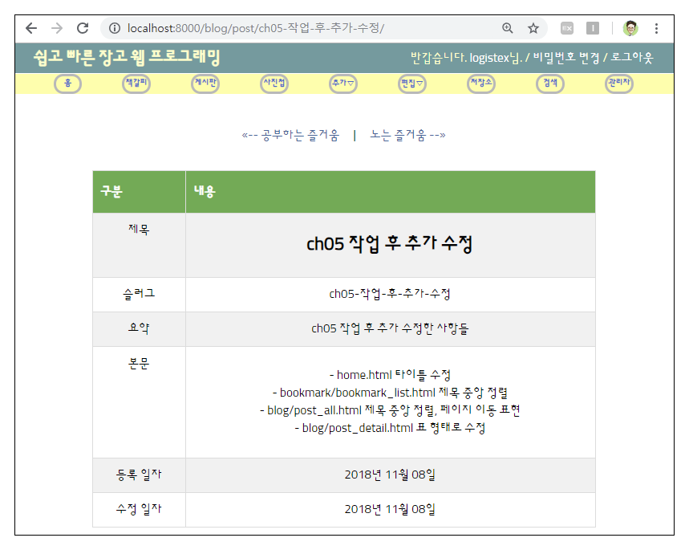
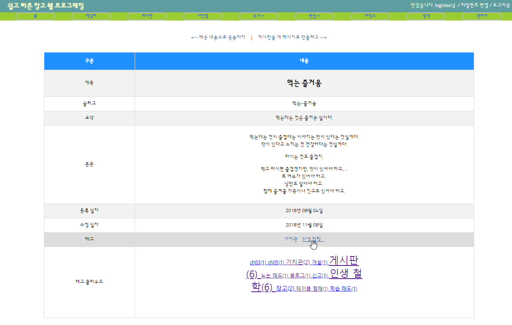
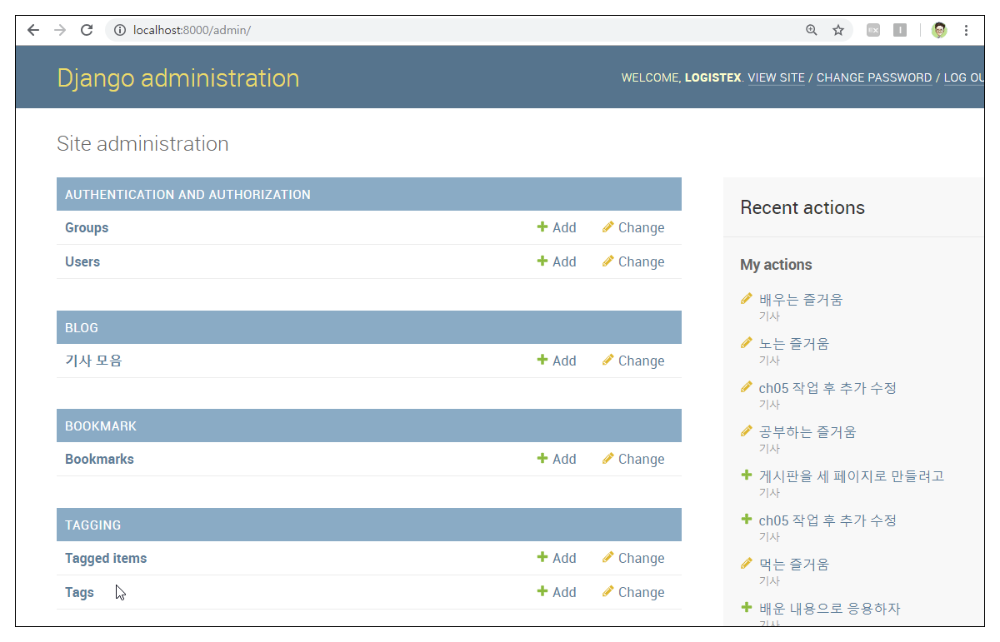
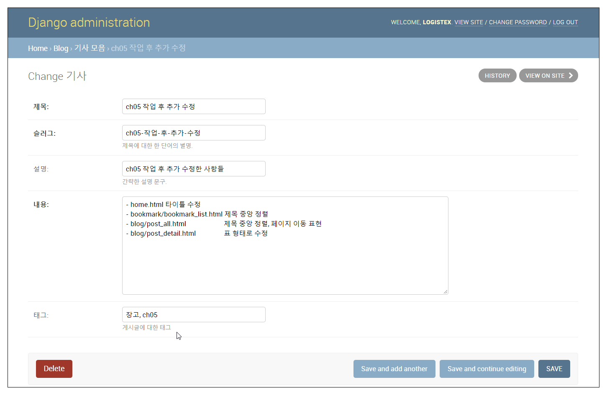

# 7. 기존 앱 개선

- 장고_자습서 <https://wikidocs.net/book/837>
- ch07 서버 모습 <http://logistex018.pythonanywhere.com/>

# 7.0 ch05장 작업 완료 후 추가 수정 사항

- home.html title 블록 내용을 'home.html'에서 '장고 웹 사이트'로 수정
- bookmark_list.html h1 태그를 중앙 정렬로 지정
- post_all.html
  - 최종 수정일 출력 부분에서 {{ object.modify_date }} 부분을
    {{ object.modify_date|date:"Y년 m월 d일" }}로 수정
  - 요약 출력 부분에서 \<p\> 태그 삭제
  - h1 태그를 중앙 정렬로 지정
  - 페이지 이동 수단에 '첫/끝 페이지' 추가
  - 현재 페이지 출력 형식을 수정
  
- blog/post_detail.html 표 형태로 수정
  

  ***

- bookmark = 책갈피 = 바로가기  
- bog = web log = 웹에서 작성하는 일지 = 웹 게시판
- 게시판 글마다 태깅 기능
  - 기사마다 태그 달기
  - 태그별로 기사 리스트 보여주기
  - 태그 클라우드 만들기
  - django-tagging 오픈 소스 패키지 활용

***

# 7.1 애플리케이션 설계

## 7.1.1 화면 UI 설계



## 7.1.2 테이블 설계
- Post 모델 클래스에 tag 속성 추가
  자료형은 TagField, 제약은 Blank

## 7.1.3 URL 설계
- 블로그 URLconf에 태그와 관련한 URL 2개 추가
  - /blog/tag/          TagTV(TemplateView)         tagging_cloud.html
  - /blog/tag/tagname/  PostTOL(TaggedObjectList)   tagging_post_list.html

## 7.1.4 작업/코딩 순서

|  <center>순서</center> |  <center>명령/파일</center>  |  <center>작업 내용</center> |
|--------            |:--------                |:--------                |
|**뼈대 만들기**      | startproject            |(ch02에서 이미 작업, 생략)|
| <center>"</center> | settings.py             |<center>"</center>|
| <center>"</center> | migrate                 |<center>"</center>|
| <center>"</center> | createsuperuser         |<center>"</center>|
| <center>"</center> | startapp                |(django-tagging 패키지 이미 설치)        |
| <center>"</center> | settings.py             |*django-tagging 앱 등록*        |
|**모델 코딩**      | models.py                |*tag 필드 추가*        |
|<center>"</center>| admin.py                 |(변경 없음)        |
|<center>"</center>| makemigrations           |*모델 변경 사항을 DB에 반영*        |
|<center>"</center>| migrate                  |        |
|**URLconf 코딩**  | urls.py                  |*URL 2개 추가*        |
|**뷰 코딩**       | views.py                 |*뷰 로직 추가*        |
|**템플릿 코딩**   | templates 폴더           |*템플릿 추가*        |
|**기타 코딩**    | static 폴더                |*태그 클라우드용 tag.css 추가*        |

***

# 7.2 개발 코딩
## 7.2.1 뼈대 만들기
- mysite/settings.py 설정 파일에 tagging 앱 추가 등록
```python {.line-numbers}
...
INSTALLED_APPS = [
    'django.contrib.admin',
    'django.contrib.auth',
    'django.contrib.contenttypes',
    'django.contrib.sessions',
    'django.contrib.messages',
    'django.contrib.staticfiles',
    'bookmark.apps.BookmarkConfig',     # (ch02) bookmark 앱을 추가 등록
    'blog.apps.BlogConfig',             # (ch03) blog 앱을 추가 등록
    'tagging.apps.TaggingConfig',       # (ch07) tagging 앱을 추가 등록
]
...  
```
## 7.2.2 모델 코딩
- blog/models.py 파일에 tag 속성 추가 등록
```python {.line-numbers}
...
from django.core.urlresolvers import reverse
from tagging.fields import TagField                 # ch07 추가

@python_2_unicode_compatible
class Post(models.Model):
    title = models.CharField('제목', max_length=50)
    slug = models.SlugField('슬러그',

                            unique=True,
                            allow_unicode=True,
                            help_text='제목에 대한 한 단어의 별명.')
    description = models.CharField('설명',
                                   max_length=100,
                                   blank=True,  
                                   help_text='간략한 설명 문구.')
    content = models.TextField('내용')  
    create_date = models.DateTimeField('최초 생성 일시',
                                       auto_now_add=True)
    modify_date = models.DateTimeField('최종 수정 일시',
                                       auto_now=True)
    tag = TagField('태그',                          # ch07 추가
                   help_text='게시글에 대한 태그')   # ch07 추가                      


    class Meta:  # 필드 속성 외에 필요한 파라미터를 Meta 내부 클래스로 정의
...  
```

- DB 수정 사항 반영 작업
```bash {.line-numbers}
(myvenv) D:\blackOcean\2018\강의\9_django18B\work18>python manage.py makemigrations
(myvenv) D:\blackOcean\2018\강의\9_django18B\work18>python manage.py migrate
```



## 7.2.3 URLconf 코딩
- blog/urls.py 추가
```python {.line-numbers}
...
  # Example: /today/
  url(r'^today/$', PostTAV.as_view(), name='post_today_archive'),

  # /blog/tag/ URL 요청을 처리할 뷰 클래스 지정, 태그 클라우드 출력용 뷰
  # Example: /tag/
  url(r'^tag/$', TagTV.as_view(), name='tag_cloud'),

  # /blog/tag/태그 이름/ 요청을 처리할 뷰 클래스 지정
  # r'...': 이스케이프되지 않는 raw 스트링임을 표시
  # [^/]+ : / 이외 문자가 한번 이상 반복
  # (?u)  : 앞의 표현식을 유니코드로 인식하라고 지정(주소창에 한글 입력 가능하도록)
  # Example: /tag/tagname
  url(r'^tag/(?P<tag>[^/]+(?u))/$', PostTOL.as_view(), name='tagged_object_list'),
]
...  
```

## 7.2.4 뷰 코딩
- blog/views.py 수정
```python {.line-numbers}
...
from django.views.generic import ListView, DetailView, TemplateView            # ch07추가01
...
from blog.models import Post
from tagging.models import Tag, TaggedItem                          # ch07추가02
from tagging.views import TaggedObjectList                          # ch07추가03

# 아래 두 클래스 추가                                               # ch07추가04
# /blog/tag/ 요청에 따라 태그 클라우드 템플릿을 출력
# TemplateView 제네릭 뷰는 테이블 처리 없이 단순 템플릿 렌더링 처리만 담당하는 뷰
class TagTV(TemplateView) :
    template_name = 'tagging/tagging_cloud.html' # 태그 클라우드를 출력하는 템플릿

# TaggedObjectList는 ListView를 상속받는 뷰로서,
# tagging 패키지는 tagging 패키지의 views.py에 정의되어 있는데,
# 모델과 태그가 지정되면, 해당 태그가 지정된 모델의 객체 리스트를
# 지정된 템플릿에 전달하는 역할
class PostTOL(TaggedObjectList) :
    model = Post
    template_name = 'tagging/tagging_post_list.html'

# ListView를 상속받아서 PostLV 작성
...  
```

## 7.2.5 템플릿 코딩

- blog/post_detail.html 수정(게시글 하단에 태그 링크 및 태그 클라우드 출력)
```html {.line-numbers}
...
      <tr>
          <td>수정 일자</td>
          <td>{{ object.modify_date|date:"Y년 m월 d일" }}</td>
      </tr>
      <!--ch07 추가-->
      <!--tagging 패키지에 정의된 커스텀 태그 사용을 위해 tagging_tags 모듈을 적재-->
      
      <!--tags_for_object 커스텀 태그를 사용하여 object 객체에 지정된 태그 리스트를 추출하여-->
      <!--tags 템플릿 변수에 저장, 여기서 object 객체는 PostDV 뷰에서 전달받는 컨텍스트 변수로서,-->
      <!--특정 Post 객체가 저장되어 있음-->
      
      <tr> <!--게시글마다 지정된 태그를 출력-->
          <td>태그</td>
          <td>
              
                  <a href="">
                    {{tag.name}}&nbsp;&nbsp;
                  </a>
              
          </td>
      </tr>
      <tr> <!--게시판에 지정된 태그 클라우드를 출력-->
          <td>태그 클라우드</td>
          <td>
              <!--http://localhost:8000/blog/tag/-->
              <!--embed 태그를 활용해서 src에 지정된 템플릿을 해당 영역에 출력-->
              <embed type="text/html" src="">
          </td>
      </tr>
    </table>  
...  
```
- blog/templates/tagging/tagging_cloud.html 작성
```html {.line-numbers}
<!DOCTYPE html>
<html lang="ko">
<head>
    <meta charset="UTF-8">
    <link rel="stylesheet" type="text/css" href="../../static/tagging/tag.css">
</head>
<body>
<div id="content">
    <div class="tag-cloud">
        
        <!--tag_cloud_for_model 커스텀 태그를 사용하여 태그 클라우드 표현 방식을 정의-->
        <!--blog.Post: 태그를 추출할 대상 모델-->
        <!--as tags: 추출한 태그를 tags에 저장-->
        <!--with steps=6 min_count=1: 태그 폰트 크기 범위를 1~6, 출력용 최소 사용 횟수를 1로 지정-->
        <!--distribution=log: 태그 폰트 크기를 지정할 때 수학 로그 알고리즘을 적용-->
        
        
        <span class="tag-{{tag.font_size}}">
            <a href="" target="_parent">
              {{tag.name}}({{tag.font_size}})
            </a>
        </span>
        
    </div>
</div>
</body>
</html>

```

- blog/templates/tagging/tagging_post_list.html 작성
```html {.line-numbers}

태그된 게시글 목록



    <div id="content">  <!--post_all.html과 동일한 형식-->
        <h1 class="centered">'{{ tag.name }}' 태그된 게시글 목록</h1>
        <table id="tbl">
            <tr>
                <th>번호</th>
                <th>최종 수정일</th>
                <th>제목</th>
                <th>슬러그</th>
                <th>요약</th>
            </tr>
            
            <tr>
                <td>{{ post.id }}</td>
                <td>{{ post.modify_date|date:"Y년 m월 d일" }}</td>
                <td>
                    <a href='{{ post.get_absolute_url }}'>
                        <strong>{{ post.title }}</strong>
                    </a>
                </td>
                <td>{{ post.slug }}</td>
                <td>{{ post.description }}</td>
            </tr>
            
        </table>
    </div>


```

- blog/static/tagging/tag.css 작성
  - 특정 앱에 소속된 정적 파일은 해당 앱 폴더 하위에 static/앱이름/ 폴더에 저장
  - 프로젝트 전체에 관련된 정적 파일은
    setting.py 내부에서 STATICFILES_DIRS 항목으로 지정한 폴더에 저장
```css {.line-numbers}
.tag-cloud {
    width: 100%;
    text-align: center;
}
.tag-1 {font-size: 12px;}
.tag-2 {font-size: 14px;}
.tag-3 {font-size: 16px;}
.tag-4 {font-size: 18px;}
.tag-5 {font-size: 20px;}
.tag-6 {font-size: 24px;}

```
