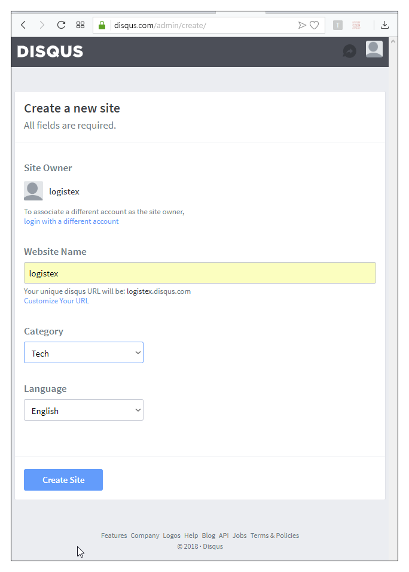

- 장고_자습서 <https://wikidocs.net/book/837>
- ch08 서버 모습 <http://logistex018.pythonanywhere.com/>

- django-disqus 패키지 활용

# 8.1 애플리케이션 설계

## 8.1.1 화면 UI 설계


## 8.1.2 테이블 설계
- 테이블 관련 변경 없음

## 8.1.3 URL 설계
- 댓글 처리는 disqus 앱에서 자바스크립트로 처리하므로, 댓글 관련 URL 변경 없음

## 8.1.4 작업/코딩 순서

|  <center>순서</center> |  <center>명령/파일</center>  |  <center>작업 내용</center> |
|--------            |:--------                |:--------                |
|**뼈대 만들기**      | startproject            |(ch02에서 이미 작업, 생략)|
| <center>"</center> | settings.py             |<center>"</center>|
| <center>"</center> | migrate                 |<center>"</center>|
| <center>"</center> | createsuperuser         |<center>"</center>|
| <center>"</center> | startapp                |(disqus 패키지 이미 설치)        |
| <center>"</center> | settings.py             |*disqus 앱 등록*        |
|**모델 코딩**      | models.py                |(변경 없음)        |
|<center>"</center>| admin.py                 |(변경 없음)        |
|<center>"</center>| makemigrations           |(변경 없음)        |
|<center>"</center>| migrate                  |*disqus 앱에서는 불필요하지만, site 앱에서 필요함*        |
|**URLconf 코딩**  | urls.py                  |(변경 없음)        |
|**뷰 코딩**       | views.py                 |(변경 없음)        |
|**템플릿 코딩**   | templates 폴더           |*템플릿 추가*        |
|**기타 코딩**    | static 폴더                |*base.css 수정*        |
|**기타 작업**    | DISQUS 홈페이지           |*계정 및 앱 설정*        |

***

## 8.1.5 DISQUS 홈페이지 작업
- DISQUS 홈페이지 <https://disqus.com>
- 계정 생성: Name, Email, Password 입력 및 동의 사항 체크하고 Signup
- 내 사이트에 DISQUS 설치를 선택

- 새 사이트 생성
  - Website Name에 입력한 사항을 기억해두어야 함!!!
  - 언어는 English
  - [Create Site] 단추를 클릭

- 계획 선택dptj Basic 선택하고, [Subscribe Now] 단추 클릭

- 메뉴에서 [3. Configure Disqus] 클릭

- [Website Name]에 새 사이트 생성에서 지정했던 Website Name 입력하고 [Complete Setup] 단추 클릭
  

# 8.2 개발 코딩
## 8.2.1 뼈대 만들기
- mysite/settings.py 설정 파일에서 4행 추가
```python {.line-numbers}
...
INSTALLED_APPS = [
    'django.contrib.admin',
    'django.contrib.auth',
    'django.contrib.contenttypes',
    'django.contrib.sessions',
    'django.contrib.messages',
    'django.contrib.staticfiles',
    'bookmark.apps.BookmarkConfig',     # (ch02) bookmark 앱을 추가 등록
    'blog.apps.BlogConfig',             # (ch03) blog 앱을 추가 등록
    'tagging.apps.TaggingConfig',       # (ch07) tagging 앱을 추가 등록
    'disqus',                           # (ch08) 1/4
    'django.contrib.sites',             # (ch08) 2/4
]
DISQUS_WEBSITE_SHORTNAME = 'logistex'   # (ch08) 3/4 [Website Name]
SITE_ID = 1                             # (ch08) 4/4 django.contrib.sites를 등록할 때 사용하는 값, 임의로 지정하지만, 중복되지 않도록!

MIDDLEWARE = [
...  
```
## 8.2.2 모델 코딩
- 테이블 수정 사항은 없으나, migrate 작업은 필요함
- django.contrib.site 앱에서 테이블이 사용됨
- DB 수정 사항 반영 작업
```bash {.line-numbers}
(myvenv) D:\blackOcean\2018\강의\9_django18B\work18>python manage.py makemigrations   
# 변화된 사항이 없다고 나옴
(myvenv) D:\blackOcean\2018\강의\9_django18B\work18>python manage.py migrate
```
## 8.2.3 URLconf 코딩
- 수정 사항 없음

## 8.2.4 뷰 코딩
- 수정 사항 없음

## 8.2.5 템플릿 코딩

- blog/post_detail.html 수정 (댓글 처리를 위한 5줄 추가)
```html {.line-numbers}
...
              <embed type="text/html" src="">
          </td>
      </tr>
    </table>
    <br/>                           <!-- ch08 1/5  -->
    <div>                           <!-- ch08 2/5  -->
              <!-- ch08 3/5  -->
          <!-- ch08 4/5  -->
    </div>                          <!-- ch08 5/5  -->     
...  
```
- static/css/base.css 수정
  디스커스 앱의 댓글 글자 크기는 수정이 불가능하므로,
  본문 글꼴 크기를 14pt 또는 16pt로 수정
```css {.line-numbers}
body {
    font-family: 'Sunflower', sans-serif;
    font-size: 16px;    /* ch08 1/1 */
}
...
```

# 8.3 서버에서 git pull 작업 오류 해결

  
